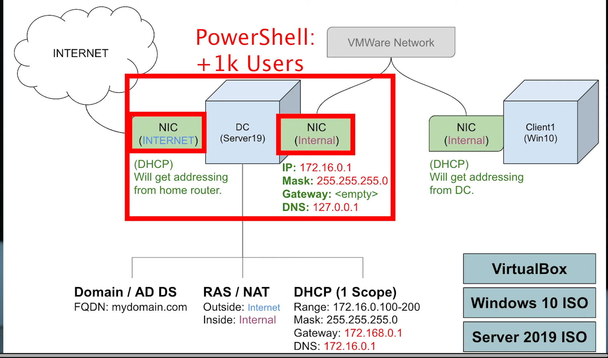

# Active-Directory-Lab-Setup-on-Oracle-VirtualBox

# ADDC01

## Resources

- **Oracle VirtualBox:**  
  [https://www.virtualbox.org/wiki/Downloads](https://www.virtualbox.org/wiki/Downloads)

- **Windows Server 2019 ISO:**  
  [https://www.microsoft.com/en-us/evalcenter/download-windows-server-2019](https://www.microsoft.com/en-us/evalcenter/download-windows-server-2019)

- **Windows 10 ISO:**  
  [https://www.microsoft.com/en-us/software-download/windows10](https://www.microsoft.com/en-us/software-download/windows10)

- **Create Accounts Script:**  
  [https://github.com/dotjmag2011/PowershellScript](https://github.com/dotjmag2011/PowershellScript)  
  *(Download: `Generate-Names-Create-Users.ps1`, `names.txt`, `1_CREATE_USERS.ps1`)*

**Password Suggestion:** `Password1`

---

## VirtualBox Configuration

1. **Download all resources listed above**
2. Open VirtualBox and create a new VM:

### Domain Controller (Server 2019)
- **Name:** DC
- **RAM:** 2048MB
- **Disk:** 20 GB
- **CPU:** 4 cores
- **ISO:** Windows Server 2019

3. In VM Settings:
   - **System → Motherboard:** Enable EFI if required
   - **Advanced → Clipboard & Drag-and-Drop:** Set both to *Bidirectional*
   - **Network:**
     - NIC 1: Attached to NAT (for Internet)
     - NIC 2: Attached to Internal Network

4. Launch VM and begin installation:
   - Choose **Windows Server Standard Evaluation (Desktop Experience)**
   - Select **Custom Installation**

---

## Promote Server to Domain Controller

1. After installation, open **Server Manager**
2. Select **"Add roles and features"**
3. Choose the following roles:
   - **Active Directory Domain Services (ADDS)**
   - **DNS Server**
4. Proceed with the installation and **Promote this server to a domain controller**
   - Create a new forest
   - Domain name: e.g., `corp.com`
   - Use default settings for DNS and NetBIOS
5. Reboot when prompted

## Post-Installation

- Verify AD DS and DNS roles are installed
- Open **Active Directory Users and Computers**
- Create new **Organizational Units (OUs)**

---

## PowerShell User Creation

### Required Files:
- `names.txt` – list of usernames
- `Generate-Names-Create-Users.ps1`
- `1_CREATE_USERS.ps1`

### Steps:
1. Place all scripts and the `names.txt` file on the DC
2. Run PowerShell as Administrator
3. Execute the script:

```powershell
`.\1_CREATE_USERS.ps1`


---

### 🧪 **Testing the Environment**

```markdown
## Windows 10 Client

1. Create a new VM:
   - **Name:** Client
   - **RAM:** 2048MB
   - **Disk:** 20 GB
   - **CPU:** 2 cores
   - **ISO:** Windows 10

2. Configure Networking:
   - NIC: Attached to **Internal Network**

3. Install Windows and configure the following:
   - Set static IP in same subnet as Domain Controller
   - Set DNS to point to the DC's IP address

4. Join the domain:
   - Right-click **This PC → Properties → Change Settings**
   - Join domain: `corp.com`
   - Enter domain credentials
   - Reboot

5. Log in with one of the created domain accounts to test


## Network Diagram



## Active Directory Icon


## Common Issues & Fixes

- **Can't join domain:**
  - Ensure client DNS is pointing to the Domain Controller IP
  - Confirm the internal network is working

- **User login fails:**
  - Check user credentials in AD
  - Reset password in Active Directory Users and Computers

- **PowerShell script errors:**
  - Ensure execution policy allows script running:
    ```powershell
    Set-ExecutionPolicy RemoteSigned
    ```
  - Run PowerShell as Administrator

## Tools & Technologies

- Oracle VirtualBox
- Microsoft Windows Server 2019
- Windows 10
- PowerShell
- Active Directory Domain Services (ADDS)
- DNS


## Summary

This lab simulates a small enterprise environment using virtual machines. It demonstrates how to:

- Deploy and configure a Windows Server 2019 Domain Controller
- Automate user creation with PowerShell
- Connect a Windows 10 client to an Active Directory domain
- Practice AD administration and network configuration in a safe, isolated environment


## License

This project is for educational and personal learning purposes. Feel free to modify and extend it for your own training labs or demos.


